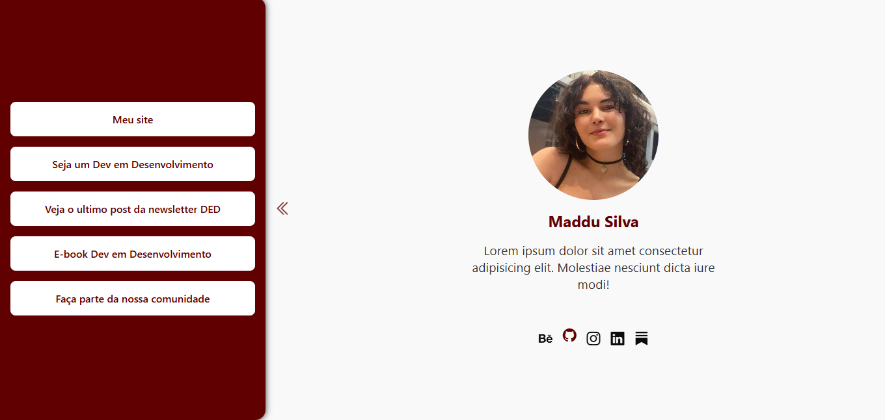

# 📱 BioLink Responsivo com Sidebar Interativa

Este projeto é uma **página pessoal estilo BioLink**, focada em oferecer uma experiência responsiva e interativa tanto no **desktop quanto no mobile**. Seu diferencial é uma **sidebar animada**, que se adapta ao comportamento de rolagem do usuário, tornando a navegação intuitiva e moderna.

> Projeto desenvolvido como parte do meu portfólio de **desenvolvedora front-end**, com foco em interações dinâmicas e responsividade.

---

## ✨ Sobre o Projeto

O **BioLink Responsivo** é voltado para **criadores de conteúdo, freelancers e profissionais autônomos** que desejam centralizar seus principais links e redes sociais em um único lugar.

🧠 A personagem fictícia **Maddu Silva** representa uma profissional tech criativa e ativa nas redes, que utiliza a plataforma para divulgar seus principais canais.

🧩 O destaque vai para a **sidebar interativa**:
- No **desktop**, surge lateralmente com botões de abrir e fechar;
- No **mobile**, ela se comporta como uma aba inferior deslizante, ativada pela rolagem da tela.

> Este projeto é fictício e visa demonstrar minhas habilidades em desenvolvimento web responsivo com **HTML**, **CSS** e **JavaScript** puro.

---

## 🎨 Sobre o Processo Criativo

A inspiração para este layout veio da necessidade de entregar uma interface que fosse:

- **Compacta e funcional** para dispositivos móveis;
- **Visualmente organizada** para usuários desktop;
- E com uma **navegação fluida**, sem a necessidade de recarregar páginas.

🧾 O design equilibra tons **vinho escuro**, **branco** e **cinza suave**, transmitindo seriedade e elegância.

🖌️ O layout responsivo e a **sidebar móvel que abre e fecha ao rolar a tela** são o grande diferencial visual e técnico do projeto.

---

## 🛠️ Ferramentas e Tecnologias Utilizadas

- **HTML5**  
- **CSS3** *(com Media Queries)*  
- **JavaScript Vanilla (puro)**  
- **Bootstrap Icons** *(ícones sociais e setas)*  

---

## 🔍 Funcionalidades

- 🔁 **Sidebar dinâmica**: abre/fecha ao clicar ou ao rolar a tela (em dispositivos móveis);  
- 🖥️ **Layout responsivo**: adapta-se elegantemente a telas pequenas e grandes;  
- 📎 **Links fictícios** organizados em cards clicáveis;  
- 📷 **Foto de perfil redonda** com design limpo e centralizado;  
- 💬 **Animações suaves** nos botões de navegação com efeito bounce;  
- 📱 **Botões rotacionados no mobile**, posicionados intuitivamente.

---

## 📸 Prévia

Você pode visualizar o projeto completo em:  
👉 [Link para Visualização](https://bio-link2.vercel.app/) 

---

## 🧠 Possibilidades de Expansão

Este projeto pode evoluir com:

- Painel administrativo (CRUD de links);
- Integração com APIs para links dinâmicos;
- Modo escuro;
- Análise de cliques nos botões via JS ou serviços externos.

---

